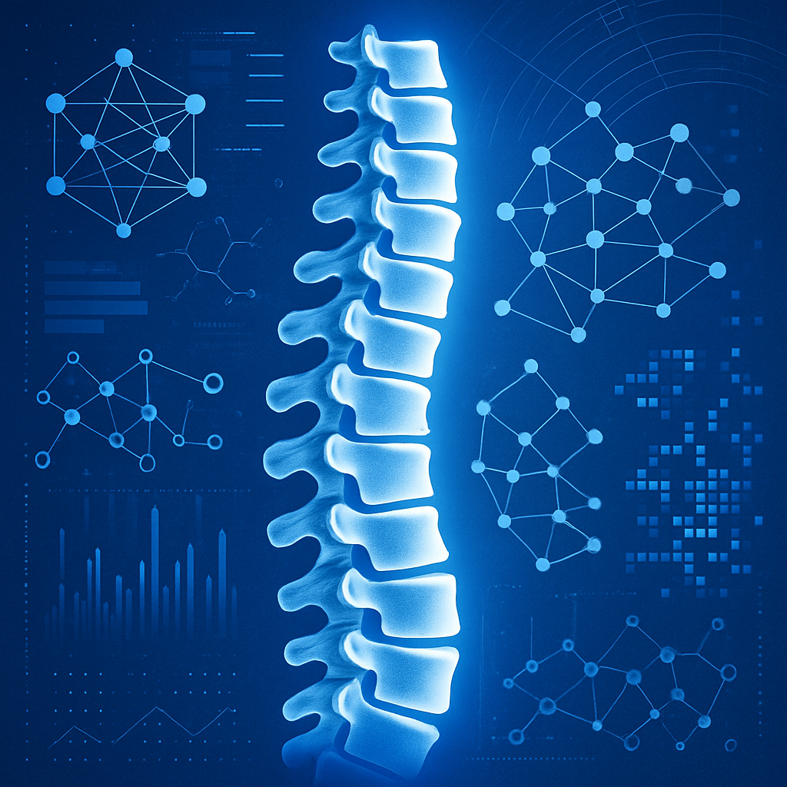
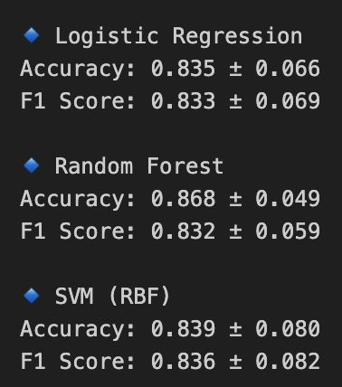
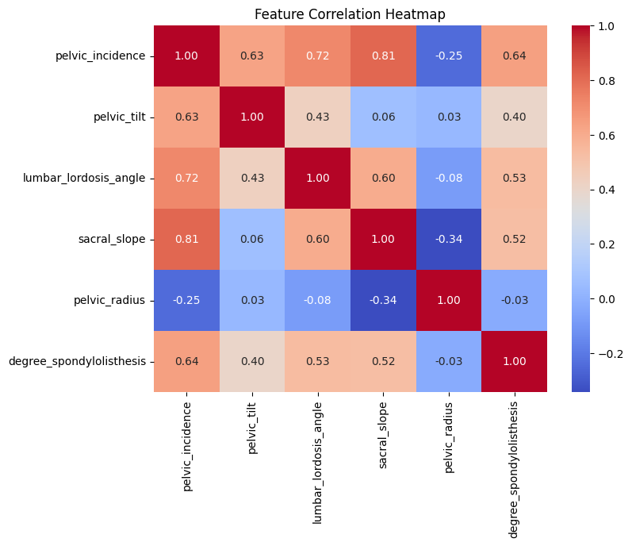
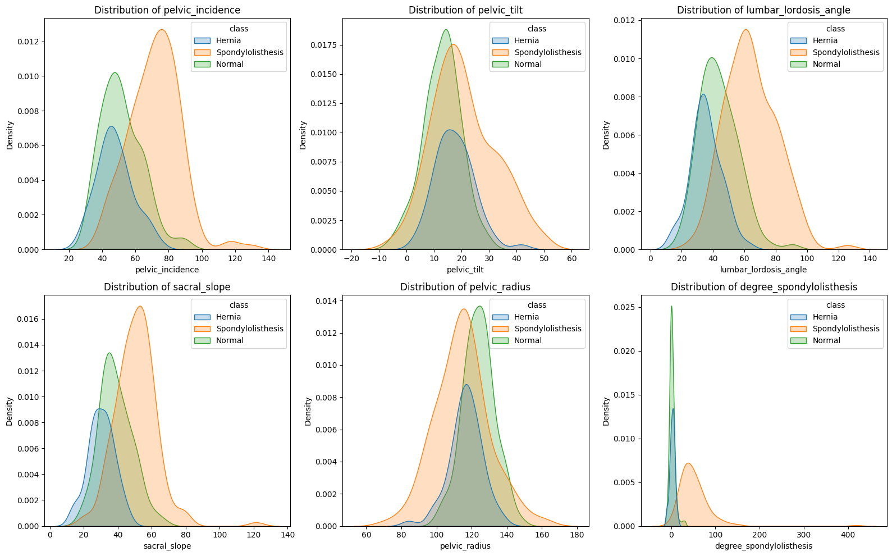

# 🦴 Vertebral Column Disorder Predictor using Machine Learning

A Streamlit-based web application that predicts vertebral column conditions such as **Hernia**, **Spondylolisthesis**, or **Normal** using machine learning algorithms and six biomechanical features from X-ray data.

---

## 🚀 Demo


---

## 📌 Features

- 🧮 **ML Models**: Random Forest, Logistic Regression, and SVM (RBF)
- 📊 **SHAP Explainability**: Understand feature importance per prediction
- 📈 **Feature Distribution Analysis** across different classes
- 📎 **.dat File Upload**: Batch file support for bulk data viewing
- ⚙️ **User Controls**: Manual inputs or use example data

---

## 💡 How It Works

1. Input six biomechanical values from spinal X-rays.
2. The Random Forest Classifier predicts the condition.
3. SHAP is used to explain prediction importance.
4. Optional visual insights: feature correlation, KDE plots, and model evaluation.

---

## 🔍 Dataset

The model uses the [`column_3C.dat`](https://archive.ics.uci.edu/ml/datasets/Vertebral+Column) dataset from the UCI Machine Learning Repository, which contains three classes:

- `Normal`
- `Hernia`
- `Spondylolisthesis`

Each sample has the following features:

- Pelvic Incidence
- Pelvic Tilt
- Lumbar Lordosis Angle
- Sacral Slope
- Pelvic Radius
- Degree of Spondylolisthesis

---

## 📉 Model Performance

Three ML models were evaluated using 5-fold cross-validation:



- **Random Forest** achieved the best overall performance with:
  - Accuracy: **0.868 ± 0.049**
  - F1 Score: **0.832 ± 0.059**

---

## 📚 Data Insights

### 🔥 Feature Correlation Heatmap



### 📊 Feature Distribution by Class



---

## 🛠️ Installation

```bash
# Clone the repo
git clone https://github.com/yourusername/vertebral-disorder-predictor-ml.git
cd vertebral-disorder-predictor-ml

# Create virtual environment
python -m venv venv
source venv/bin/activate  # or venv\Scripts\activate on Windows

# Install dependencies
pip install -r requirements.txt

# Run the app
streamlit run app.py
```
📁 File Structure

vertebral-disorder-predictor-ml/
├── app.py
├── column_3C.dat
├── demo.png
├── accuracy.png
├── corr.png
├── features.png
├── requirements.txt
└── README.md

📦 Dependencies
	•	streamlit
	•	pandas
	•	numpy
	•	scikit-learn
	•	shap
	•	matplotlib
	•	seaborn
```bash
Install all via: pip install -r requirements.txt
```
### 🙋‍♂️ Author
 Mohammed Yousuf
AI/ML Engineering Student | Passionate about Machine Learning, Computer Vision, and Real-World Applications 🚀
Feel free to reach out or contribute!
### 📄 License
This project is licensed under the MIT License.
### 🌟 Star this repository
If you found this helpful, give it a ⭐ on GitHub!
